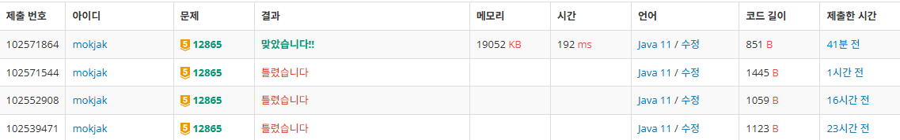

<aside>
📘

## 학습한 내용

배낭 문제(Knapsack)의 중복 선택 제어 및 DP 최적화

</aside>

## 📝 문제 요약

> **상황**: 한정된 무게 K 내에서 가치 V가 최대가 되도록 물건들을 담기
**조건**: 각 물건은 **단 하나**만 존재함 (0/1 Knapsack)
**목표**: O(NxK)이내의 효율적인 탐색과 중복 계산 방지
> 

---

## 💡 1. 나의 접근 방식 & 핵심 아이디어

- **알고리즘/자료구조: Dynamic Programming (DP)**
- **시간/공간 복잡도:**
    - **시간:** `O(NK)`
    - **공간:** `O(K)`
- **핵심 로직:**
    1. **1차원 배열 최적화**: 메모리 절약을 위해 `dp[K+1]` 배열만 사용.
    2. **역순 순회(Backward Iteration)**: 물건을 중복 사용하는 것을 막기 위해, 배낭 무게를 `K`부터 `W`까지 거꾸로 탐색하며 갱신.
    3. **점화식**: `dp[j] = Math.max(dp[j], dp[j - weight] + value)`

---

## ✨ 2. 나의 최종 코드

- 코드 보기
    
    ```jsx
    // 핵심 로직: 역순 순회를 통한 1차원 DP 최적화
    for (int i = 0; i < N; i++) { // 각 물건에 대해
        int W = weight[i], V = value[i];
        for (int j = K; j >= W; j--) { // 배낭 무게를 뒤에서부터 계산
            dp[j] = Math.max(dp[j], dp[j - W] + V);
        }
    }
    ```
    

---

## 🤔 3. 문제 회고 (Retrospective)

### 🐾 3-1. 오류 해결 과정 (Troubleshooting Log)


- **Issue 1: 물건 중복 계산 (무한 선택 오류)**
    - **현상**: `dp[k] + dp[i-k]` 방식으로 계산 시 한 물건이 여러 번 포함됨.
    - **원인**: 동전 교환(Unbounded) 문제와 0/1 Knapsack의 차이를 간과함.
    - **해결**: 물건 중심의 루프로 변경하고 **역순 순회**를 도입하여 '이전 물건까지의 결과'만 참조하도록 수정.
- **Issue 2: 데이터 구조의 오버헤드**
    - **현상**: `HashMap` 사용 시 불필요한 메모리 사용 및 동일 무게 물건 처리 곤란.
    - **해결**: 입력과 동시에 DP를 갱신하거나 배열을 사용하여 접근 속도를 `O(1)`로 최적화.

### **🌱 3-2. 새롭게 알게 된 점 (Learning Points)**

- **DP의 방향성**: 왜 1차원 배낭 문제에서 **역순**이 중복을 막는 방법인지 논리적으로 이해함.
- **입력 처리 최적화**: 물건을 다 저장한 뒤 계산하는 것보다, **입력받는 즉시 DP를 갱신**하는 것이 메모리 효율적임을 배움.

### 🧐 3-3. 더 궁금한 점 & 다음 목표 (Further Questions)

- **Bitset 최적화**: 가치가 아닌 '가능 여부'만 판단할 때 사용하는 비트연산 최적화 기법 공부.
- **배낭 문제 응용**: 물건의 개수가 제한된 'Multiple Knapsack' 문제로 확장 학습 예정.