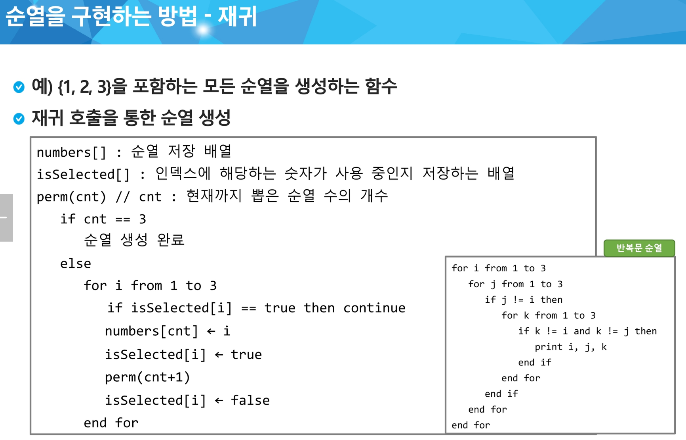

# 🧪 BOJ 14502 – 연구소

## 📌 문제 요약

- 크기 N × M 격자 (최대 8×8)
- 각 칸의 의미
  - 0 : 빈 칸
  - 1 : 벽
  - 2 : 바이러스

- **3개의 벽**을 새로 세운 뒤,
- 바이러스가 상하좌우로 퍼질 때
- 최종적으로 남아 있는 **0의 개수의 최댓값**을 구한다.

---

## 💡 풀이 전략

이 문제는

> **벽 배치 + 시뮬레이션**

구조로 푸는 완전 탐색 문제이다.

---

### 1️⃣ 벽 3개 배치 → 조합 + 재귀

- 모든 빈 칸(0)의 좌표를 `emptyPlaces` 리스트에 저장

- 이 리스트에서 **3개를 조합**으로 선택

- 순열이 아니라 **조합**이므로
  - 재귀 함수에 `start` 인덱스를 사용하여

  - 이미 선택한 위치 이전은 다시 선택하지 않도록 한다

👉 형태

- buildWalls(cnt, start)
  - cnt == 3 이 되면 시뮬레이션 시작

  - 아니라면 start부터 끝까지 탐색하면서 벽 설치

### ※ 2월 4일 순열 수업의 재귀 수도 코드 참고



---

### 2️⃣ 현재 벽 배치 상태를 임시 맵에 복사

- 원본 맵(origin)은 계속 재사용해야 하므로

- 벽이 세워진 상태를 임시 맵(temp) 에 깊은 복사

### ※ 얕은 복사 / 깊은 복사 (간단 정리)

- **얕은 복사**
  → 객체의 주소 복사 : **동일한 주소**

- **깊은 복사**
  → 객체의 **데이터 복사** : **다른 주소**

- 1차원 배열은 `clone()` 만으로 깊은 복사가 되지만
- 2차원 배열은 바깥 배열만 복사되므로
  반드시 각 행을 for문으로 `clone()` 해야 한다.

```java
for (int i = 0; i < N; i++) {
    temp[i] = origin[i].clone();
}
```

---

### 3️⃣ 바이러스 확산 → BFS

- `temp` 맵에서

- 모든 바이러스 위치(값이 2인 칸)를 시작점으로

- **멀티 소스 BFS** 수행

- `0`인 칸만 `2`로 변경하면서 확산

---

### 4️⃣ 안전 영역 계산

- 확산이 끝난 `temp` 맵에서

- 값이 `0`인 칸의 개수를 전부 세어

- 이번 배치의 안전 영역 크기로 사용

---

### 5️⃣ 전체 경우 중 최댓값 갱신

- 모든 벽 배치 조합에 대해 반복

- 안전 영역의 최댓값을 갱신
  `answer = max(answer, safeCnt)`

---

## 🧩 전체 흐름

```
빈 칸 3개 조합 선택
        ↓
임시 맵에 복사
        ↓
바이러스 BFS 확산
        ↓
안전 영역(0) 개수 계산
        ↓
최댓값 갱신
```

---

## ✅ 핵심 포인트

- 벽 배치 → 조합(재귀 + start 인덱스)
- 확산 → BFS
- 계산 → 안전 영역(0) 전체 개수
- 시뮬레이션은 반드시 임시 맵에서 수행
